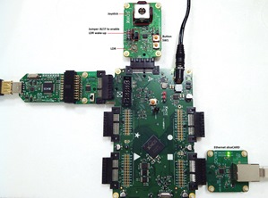
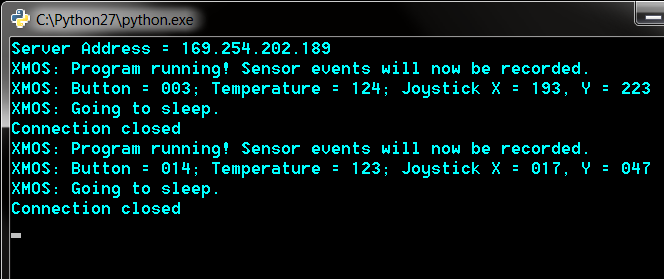

A16 sliceKIT Ethernet Sleep Wake Combo Demo Quickstart Guide
============================================================

This simple demonstration of xTIMEcomposer Studio functionality that uses the ``XA-SK-E100`` and ``XA-SK-MIXED SIGNAL``sliceCARDs together with the xSOFTip ``module_analog_tile_support`` and ``module_xtcp`` to demonstrate how the chip can be made to sleep and wake up using different sources. The app also runs a TCP web client and informs web server before going to sleep and after waking up from sleep.

Hardware Setup
++++++++++++++

The A16 sliceKIT Ethernet Sleep Wake Combo Demo Application requires the following items:

- XP-SKC-A16 sliceKIT core board.
- XA-SK-E100 Ethernet sliceCARD
- XA-SK-MIXED SIGNAL sliceCARD
- XTAG-2 & XA-SK-XTAG2 adapter board
- Ethernet and USB cables
- 12V DC power supply

To setup the system:

#. Ensure that the room (in which is demo is presented) is well lit as in this demo the LDR will be used to detect light.
#. Connect ``XA-SK-XTAG2`` to sliceKIT Core board and ``XTAG-2`` to the adapter board.
#. Connect the ``XTAG-2`` to host PC using USB cable. Note that the USB cable is not provided with the sliceKIT starter kit.
#. Connect ``XA-SK-E100`` sliceCARD to the sliceKIT Core board using the connector marked with the ``SQUARE``.
#. Connect ``XA-SK-E100`` sliceCARD and host computer using Ethernet cable.
#. Connect ``XA-SK-MIXED SIGNAL`` sliceCARD to the sliceKIT Core board using the connector marked with the ``A``.
#. Switch on the power supply to the sliceKIT Core board.

   Hardware Setup for A16 sliceKIT Ethernet Sleep Wake Combo Demo Application

Host Computer Setup
+++++++++++++++++++

- Install Python on the host computer from http://www.python.org/.
- If you are planning to connect the Ethernet cable directly to your host computer's Ethernet port, it may be required to setup a static IP configuration. Please configure your wired connection IPv4 settings to provide a static IP address. For example, IP address = 169.254.186.191; Netmask = 255.255.0.0; Gateway = 255.255.255.0 
   - For Mac: Navigate to ``System Preferences -> Network -> Ethernet -> Configure IPv4 -> Manually``
   - For Linux (Ubuntu): Navigate to ``System Settings -> Network -> Wired -> Edit a Wired Connection -> IPv4 Settings -> Manually`` and provide the IP address in the space below it.
   - For Windows: No need to configure.

To test the web server setup, a simple client is provided in ``$/app_a16_slicekit_ethernet_sleep_wake_combo_demo/xmos_python_webserver``:

#. Navigate to ``$/app_a16_slicekit_ethernet_sleep_wake_combo_demo/xmos_python_webserver``
#. Run ``server.py``. The server IP address will be displayed in the console.
#. Run ``test_client.py`` with server IP address as argument.
#. The client would open, send a message to web server close the connection, twice!
#. Look for the message *Hi from test client* in the Server console. If this message is displayed (twice), the web server setup is alright.

Please note 

- administrator privileges may be required to run the ``server.py`` and ``test_client.py``. 
   - For Windows: start command prompt as an administrator and then execute the python scripts.
   - For Mac / Linux: run the scripts with *sudo*. 
- ``test_client.py`` could be run on a different workstation provided that the two workstations are connected via a Ethernet cable.

Import and Build the Application
++++++++++++++++++++++++++++++++

#. Open xTIMEcomposer and check that it is operating in online mode. Open the edit perspective (Window->Open Perspective->XMOS Edit).
#. Locate the ``A16 sliceKIT Ethernet Sleep Wake Combo Demo`` item in the xSOFTip pane on the bottom left of the window and drag it into the Project Explorer window in the xTIMEcomposer. This will also cause the modules on which this application depends to be imported as well.
#. Open the file ``$/app_a16_slicekit_ethernet_sleep_wake_combo_demo/src/app_a16.xc``
#. Go to line:57 and change the IP address (of the web server) that the web client will try to connect to.
#. Save the application using File -> Save.
#. Click on the ``app_a16_slicekit_ethernet_sleep_wake_combo_demo`` item in the Project Explorer pane then click on the build icon (hammer) in xTIMEcomposer. Check the console window to verify that the application has built successfully.

For help in using xTIMEcomposer, try the xTIMEcomposer tutorial, which you can find by selecting (Help->Tutorials) from the xTIMEcomposer menu.

Note that the Developer Column in the xTIMEcomposer on the right hand side of your screen provides information on the xSOFTip components you are using. Select the ``module_analog_tile_support`` component in the Project Explorer, and you will see its description together with API documentation. Having done this, click the `back` icon until you return to this quick start guide within the Developer Column.

Flash the Application
+++++++++++++++++++++

Now that the application has been compiled, the next step is to flash it on the sliceKIT Core Board using the tools to load the application over JTAG into the xCORE multicore microcontroller.

- Select the file ``app_a16.xc`` in the ``app_a16_slicekit_ethernet_sleep_wake_combo_demo`` project from the Project Explorer.
- Click on the ``Flash`` icon.
- At the ``Select Device`` dialog select ``XMOS XTAG-2 connect to L1[0..1]`` and click ``OK``.
- Flashing progress messages are displayed in the console.
- After a successful flash, power cycle the sliceKIT core board.

The Demo
++++++++

- Navigate to ``$/app_a16_slicekit_ethernet_sleep_wake_combo_demo/xmos_python_webserver``
- Double click or Run the python script: ``server.py``
- The following message is displayed in the Python console::

   Server Address = 169.254.202.189
   *Note: This IP address may change depending on your network.*
   
- Wait until the following message is displayed::

   XMOS: Program running! Sensor events will now be recorded.
   
- Click (press and release) button - SW1 on the ``XA-SK-MIXED SIGNAL`` sliceCARD three times.
- Move the joystick to some position and hold it there until this message::

   XMOS: Button = 003; Temperature = 124; Joystick X = 193, Y = 223
   (Note: the temperature and Joystick position may vary depending on the current room temperature and joystick position as held by the user).

- Release the joystick.   
- Next the following message is displayed::
   
   XMOS: Going to sleep.
   Connection closed
   
- At this point, the chip enters sleep mode and could be woken up by two sources:
   
   - If the room gets dark - LDR triggers wake signal on low light
   - The internal sleep timer expires - currently set to 1 minute
   
- Once woken up, the program will try to connect to the running web server, display the sensor data and go back to sleep.

   Sample messages from chip to web server
   
*Note:*

- The web server configuration is stored in sleep memory. When the chip wakes up, the program will look in the sleep memory for valid data.
- The sleep timer can be changed at line 25: ``$/app_a16_slicekit_ethernet_sleep_wake_combo_demo/src/app_a16.xc``::
   
   #define SLEEP_TIME 60000 //Time asleep in ms

Next Steps
++++++++++

- Review the ``app_a16_slicekit_ethernet_sleep_wake_combo_demo`` application code, ``module_analog_tile_support`` module code. Refer to the documentation for each of them to see the API details and usage.
