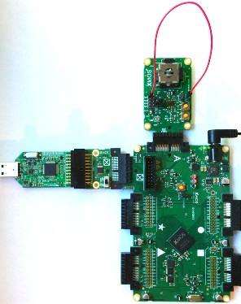
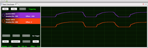

xCORE-Analog ADC PWM Loopback Demo Quick Start Guide
====================================================

.. _app_adc_pwm_demo_a_quick_start:

app_adc_pwm_demo_a Quick Start Guide
------------------------------------

This application demonstrates how to use the ADC on xCORE-Analog (A-Series) ``XS1-A16 sliceKIT`` starter kit.

The application reads one channel of the ADC connected to one axis of the analog joystick and uses this value to drive a PWM signal on a 1b port. The filtered PWM is then read by a second ADC channel, and both results are printed to the console whenever the second ADC value changes.

Hardware Setup
++++++++++++++

The XP-SKC-A16 SliceKIT Core board has four slots with edge connectors: ``STAR``, ``TRIANGLE``, ``CIRCLE`` and ``SQUARE``. 

To setup up the system(:ref:`app_adc_pwm_demo_a_hw`):

   #. Connect XA-SK-MIXED SIGNAL Slice Card to the XP-SKC-A16 SliceKIT core board using the connector marked with the ``A``.
   #. Connect the XTAG2 to the sliceKIT core board.
   #. Set the ``xCONNECT Link`` to ``ON`` on the XTAG Adapter. This enables the debug XMOS Link and allows xSCOPE functionality.
   #. Connect the XTAG-2 to host workstation, optionally using a USB extension cable shown (not provided with the sliceKIT starter kit).
   #. Connect a flying lead between ADC4 input (J2 pin 1) and PWM2 (P2 pin 1). This connects filtered PWM output to the ADC so it can be read.
   #. Switch on the power supply to the sliceKIT Core board.

.. note:: The demo will run without the flying lead from the PWM to ADC4 input, however the two ADC values will not track as intended.

.. _app_adc_pwm_demo_a_hw:

   Hardware Setup for ADC PWM Loopback Demo

Software Setup
++++++++++++++

    #. Ensure your workstation has xTIMEcomposer 13.0.0 or later installed. For supported platforms and tools downloads, go to the `xTIMEcomposer downloads page <http://www.xmos.com/support/downloads/xtimecomposer>`_.

	
Import and Build the Application
++++++++++++++++++++++++++++++++

   #. Launch xTIMEcomposer and check that it is operating in online mode. Open the edit perspective (Window->Open Perspective->XMOS Edit).
   #. Locate the ``'PWM DAC to ADC analog loopback example'`` item in the xSOFTip pane on the bottom left of the window and drag it into the Project Explorer window in the xTIMEcomposer. This will also cause dependent modules (in this case, module_analog_tile_support) to be imported as well. 
   #. Click on the ``app_adc_pwm_demo_a`` item in the Project Explorer pane then click on the build icon (hammer) in xTIMEcomposer. Check the console window to verify that the application has built successfully.

For help using xTIMEcomposer, try the xTIMEcomposer tutorial, which you can find by selecting Help->Tutorials from the xTIMEcomposer menu.

Note that the Developer Column in the xTIMEcomposer on the right hand side of your screen provides information on the xSOFTip components you are using. Select the ``module_analog_tile_support`` component in the Project Explorer, and you will see its description together with API documentation. Having done this, click the `back` icon until you return to this quickstart guide within the Developer Column.

Run the Application
+++++++++++++++++++

Now that the application has been compiled, the next step is to run it on the sliceKIT using the tools to load the application over JTAG (via the XTAG2 and XTAG Adapter card) into the xCORE multicore microcontroller.

   #. Select the file ``main.xc`` in the ``app_adc_pwm_demo_a`` project from the Project Explorer. This resides in the /src directory.
   #. From the ``Run`` pull down menu, select ``Run Configurations``. In the left hand pane of the run configurations dialogue, you will see the ``xCORE Application``. Double click (or right click-new) ``xCORE Application``. You will see the ``Main`` tab of the right hand pane containing target options. Ensure that ``hardware`` is selected from the ``Device options`` box. If you only see ``Simulator`` as the available target then please check to ensure the XTAG-2 debug adapter is properly connected to your host workstation. Next choose ``Run xSCOPE output server`` from the I/O options selection near the bottom. This will enable collection of debug print lines from the application, using low-intrusiveness printing via xSCOPE.
   #. Now run the application by clicking on the ``Run`` button at the bottom right. When the application is running, click on the ``Console`` tab at the bottom of xTIMEcomposer to view print output.
   #. You should see the text ``Analog loopback demo started.`` in the console window followed by ``ADC joystick : <value>  ADC header : <value`` showing the read values from the joystick and header ADC inputs.
  
Enable Real-Time xSCOPE
+++++++++++++++++++++++

xTIMEcomposer includes xSCOPE, a tool for instrumenting your program with real-time probes. This tool allows you to collect data and display it within xTIMEcomposer. This allows both a graphical output and as well as very low intrusiveness console printing. 

  #. Enable real-time xSCOPE. From the ``Run`` pull down menu, select ``Run Configurations``. In the left hand pane of the run configurations dialogue, you will see the ``xCORE Application -> app_adc_pwm_demo_a.xe`` tree, which was created from the previous run. Select  ``app_adc_pwm_demo_a.xe``, and in the ``xSCOPE`` tab, select ``Real-Time [XRTScope] Mode``. This will instruct the tool to be render received xSCOPE data in real time. Click ``Apply`` followed by ``Run``.
  #. View the two ADC inputs within xSCOPE. After running the program again, select the ``Real-time Scope`` window at the bottom and click on ``auto``, followed by square to the left of the signal ``Joystick ADC`` and ``Header ADC``. Next click ``Falling`` and finally click on the trace display window to set the trigger time and level. You should see traces - the sampled joystick value and the generated PWM/DAC value, which of course lags due to the timed delay within the software loop. 

   xSCOPE display showing sampled ADC values

For further details about real-time, in circuit debugging with xSCOPE, please refer to `xTIMEcomposer User Guide
<http://www.xmos.com/trace-data-xscope-0/>`_.  
   
Next Steps
++++++++++

Change the update rate to 25 milliseconds. Locate and change the following line in ``main.xc`` from::

  #define LOOP_PERIOD     10000000 // 100ms for printing and ADC trigger

to::

  #define LOOP_PERIOD      2500000 // 25 ms for printing and ADC trigger

Run the program again. Note the update rate of printing in the console window.

Change the input from joystick to the Light Dependent Resistor (LDR). Locate and change the following line from::

  adc_config.input_enable[2] = 1; //Input 2 is one axis of the joystick

to::

  adc_config.input_enable[0] = 1; //Input 0 is the LDR

Run the program again. Wave your hand over the mixed signal slice, or shine a light on the board. Notice the output in the console window as you do.

